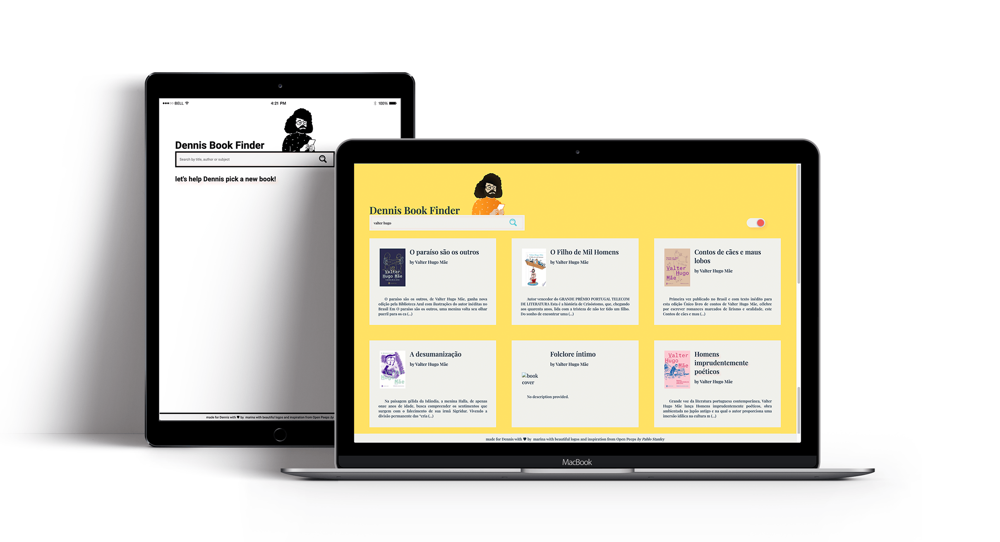

<h2 align="center">
    
</h2>

<h4 align="center">
  Let's help Dennis pick a new book!
</h4>

## Project

  Simple project to test styled-components.

## Technologies / credits

- [React](https://reactjs.org)
- [styled-components](https://styled-components.com/)
- [react-switch](https://www.npmjs.com/package/react-switch)
- [Google Books API](https://developers.google.com/books) and Google Fonts
- [beautiful logo and inspiration from Open Peeps by Pablo Stanley](https://www.openpeeps.com/)
- [search icon from iconmonstr](https://iconmonstr.com/)
